# Setting up the Unity integration with a new project

## Making a new project

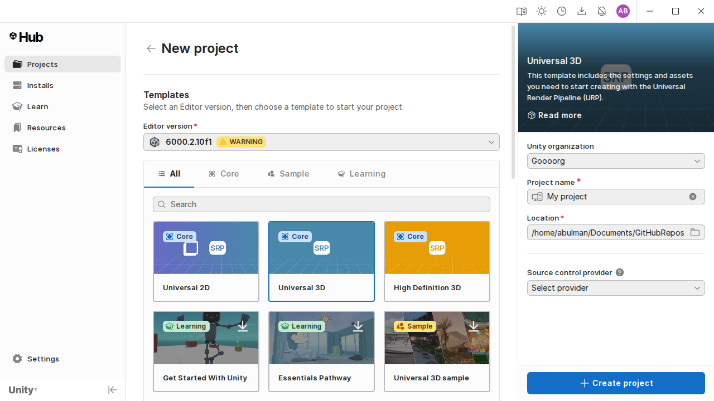

The Unity integration is designed to work with any Unity project without requiring a specific version of Unity, but for this tutorial, the Universal 3D template will be used, along with Unity 6000.2.10f1. Regardless, the majority of this tutorial should remain relevant for differing Unity versions and project templates.

## Preparing the project for the Unity integration

Once the project is open, ensure the Addressables and TextMeshPro packages are added to the project.

### Adding Addressables

In the title bar of the Unity editor, select 'Window &rarr; Package Management &rarr; Package Manager'.

In the furthest left section of the window that opens, select 'Unity Registry'. Then in the search bar, search for 'Addressables' (in versions of Unity other than Unity 6, the package manager window may differ visually).

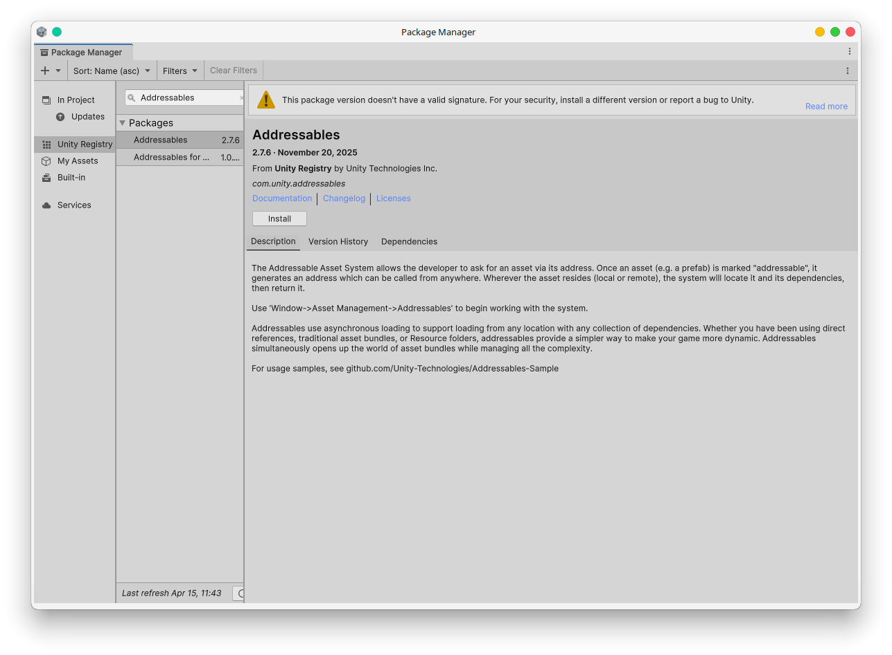

Select the package titled 'Addressables' and press 'Install'. After a small moment, Addressables will be ready for use within the project.

### Adding TextMeshPro

To add TextMeshPro to a project, right click within the scene hierarchy and select either '3D Object &rarr; Text - TextMeshPro' or 'UI &rarr; Text - TextMeshPro'.

Pressing either of these options will cause the window shown below to appear:

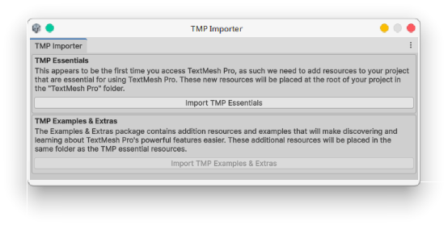

Select 'Import TMP Essentials' and after a few moments, TextMeshPro will be ready for use with your project.

## Importing the Unity integration

Download the most recent release of the Unity integration from [here](https://github.com/HeckingGoose/Oyster-UnityIntegration/releases/latest).

Drag and drop the downloaded `.unitypackage` file into the root of your project's 'Assets' folder.

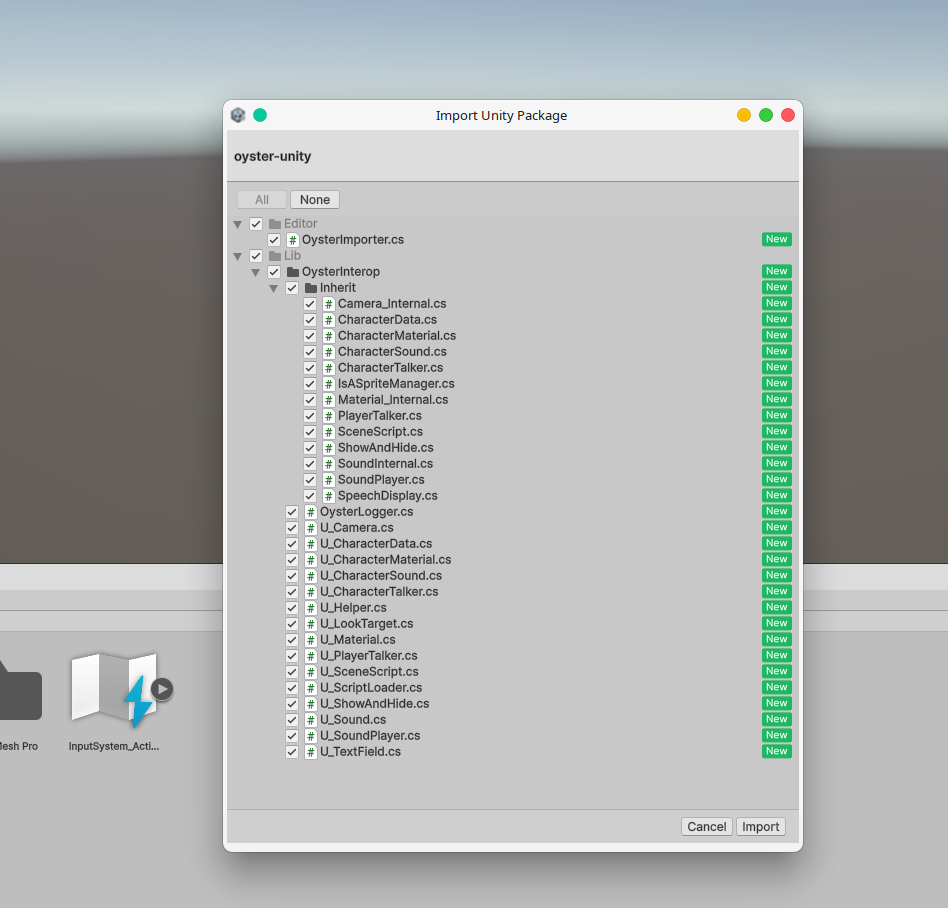

In the window that appears, leave all items ticked and select 'Import' in the bottom right of the window.

For a quick explanation on the two main folders:

- **Lib**: Contains the Unity implementation for Oyster, with scripts intended for direct use in a scene being prefaced with 'U_',
- **Editor**: Contains an editor script that Addressables uses to know how to handle the `.osf` file extension that Oyster uses for its scripts.

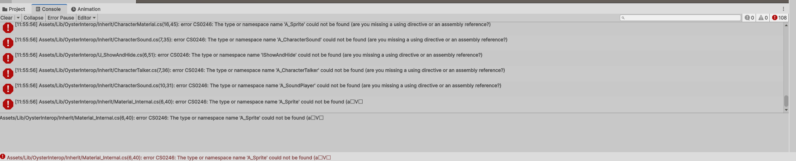

And..... Congratulations!

Now your blank project has around a hundred compile errors. This is due to the project not containing the engine-agnostic DLL. Please download the latest release of the DLL from [here](https://github.com/HeckingGoose/Oyster/releases/latest) and drag it into the assets folder of the project.

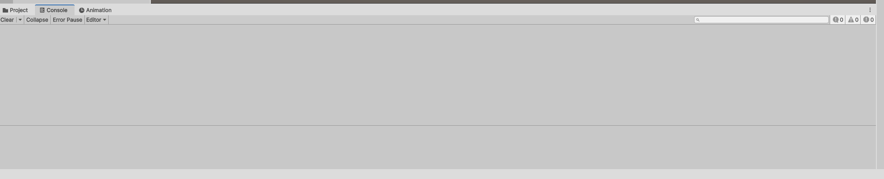

As can be seen, once the DLL has been added, all compile errors should be gone. If this is not the case, then please let Jesus take the wheel as you write out an issue on this repository.

## Setting the scene

To start with, let's remove all objects from the scene and then create a new GameObject for the player and place a `U_PlayerTalker` script on it.

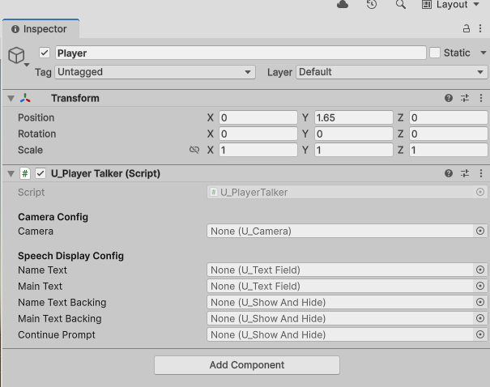

This script acts as a central way for Oyster to access functionality relating to the player. Let's now add a camera to the player by creating a new GameObject that will be a child of the player object, and giving it a `Camera` component, then a `U_Camera` component so that Oyster can access the camera's functionality.

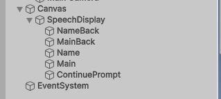

Now we can start work on a speech display for the player, to start with let's create a new canvas to place the components on, and then on that canvas create the following structure:

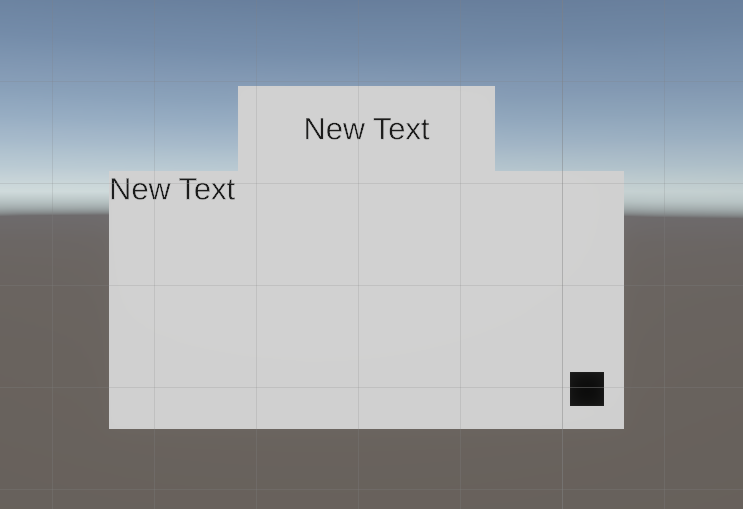

Here is a quick discussion of each of these components:

- **SpeechDisplay**: The root GameObject for the speech display, does not need to contain any extra scripts,
- **MainTextBack**: An image that will be behind the main text that Oyster uses to show dialogue on screen, add a `U_ShowAndHide` to this GameObject,
- **MainText**: The aforementioned main text that Oyster uses to show dialogue on screen, add a `U_TextField` to this GameObject,
- **NameTextBack**: An image that will be behind the text that Oyster uses to show a character's name, add a `U_ShowAndHide` to this GameObject,
- **NameText**: The aforementioned text that Oyster uses to show a character's name, add a `U_TextField` to this GameObject,
- **ContinuePrompt**: This component is not absolutely required for the speech display, but when Oyster is waiting for input from the user (as in to click to continue text), this GameObject will be toggled between shown and hidden, add a `U_ShowAndHide` to this GameObject.

These components may be laid out anywhere on the canvas, with most of them actually being optional (for example you may not want to have a NameText), for the sake of this tutorial, they will be laid out as shown below (where the top text field and box are the NameText and the bottom box and text field are the MainText, with the black square being the continue prompt):

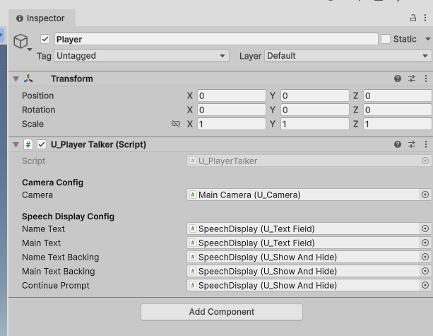

Now that we have our speech display set-up properly, we can start dragging these components onto their respective places on the player talker, creating this:

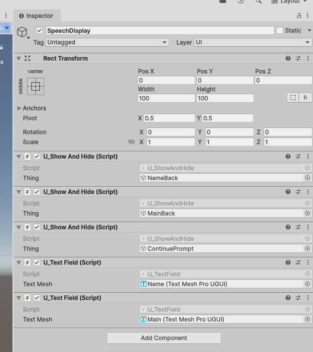

Congratulations! You have set up a player for use with Oyster. Next on the agenda is to set-up a scene script, which is as simple as creating a blank GameObject anywhere in the scene and adding a `U_SceneScript` component to it:

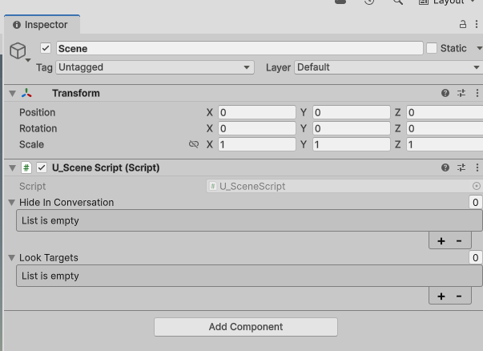

For this script, nothing needs to be changed for it to work, however an explanation of each component of it will be given:

- **Hide in Conversation**: This is an array of `U_ShowAndHide` that will be hidden when a conversation is started, and shown when a conversation ends. The purpose being to hide any unwanted UI elements during a conversation. The speech display show and hides do not need adding to this array, as they are managed automatically from their references within the player talker,
- **Look Targets**: This is an array of look targets that Oyster will reference when running the [Set_Looker](https://oyster.abulman.com/writing/supportedcommands/base/set_looker) command.

```csharp
...

private void Update()
{
    // Give Oyster a heartbeat
    OysterMain.Update(Time.deltaTime);
}

...
```

Taking a look inside of the scene script, it can be seen that it calls the `Update` function of Oyster. This acts as the heartbeat of Oyster and is what allows Oyster to frequently run its `Tick` function. Effectively, having more than one scene script in a scene would end up with this function being called too frequently, so please don't do that. Or do. It's your choice.

Next we will set-up a basic character in the scene, to do this, create this object structure in the scene hierarchy:

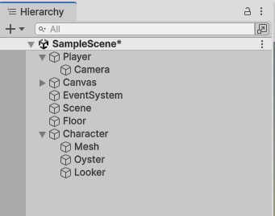

In the above image 'Floor' is simply a plane at location (0,0,0), 'Character' is an empty at location (1.1,0,3.204), 'Mesh' is a 3D capsule object at location (0,1,0), 'Oyster' is an empty where we will place our Oyster-related scripts and 'Looker' is an empty at location (0,1.5,0) where we will be placing a looker script that the camera can turn to when in conversation.

The mesh is not absolutely required, however generally characters are visually there in a game, so having this capsule will do fine as a way to represent the character in the scene.

Next, create the following scripts on the 'Oyster' GameObject:

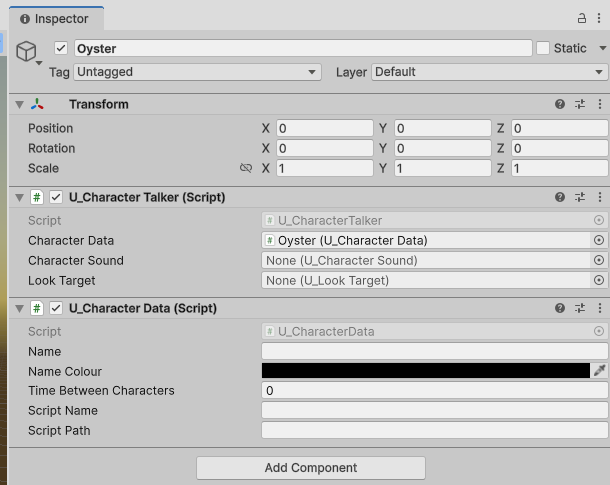

In the implementation there also exist two other scripts, which are example implementations of additional Oyster functionality, but are not required for a conversation to function, explanations of them are below:

- **U_CharacterMaterial**: An example implementation of the sprite swapping triggered by [Set_Sprite](https://oyster.abulman.com/writing/supportedcommands/base/set_sprite) that uses a MeshRenderer and Materials to implement the sprite swapping. This script can be used as a reference for implementing the same functionality with sprites for example,
- **U_CharacterSound**: An example implementation of the sound playback functionality that Oyster uses with commands such as [Act_Speak](https://oyster.abulman.com/writing/supportedcommands/base/act_speak).

Now add a `U_LookTarget` script to the 'Looker' GameObject. Feel free to give it any name you wish, and optionally drag the 'Looker' object as the 'Target' reference, if you do not do this, the script will default to the object that it is currently on for its target position. In this set-up, this has no functional difference, but is relevant to mention.

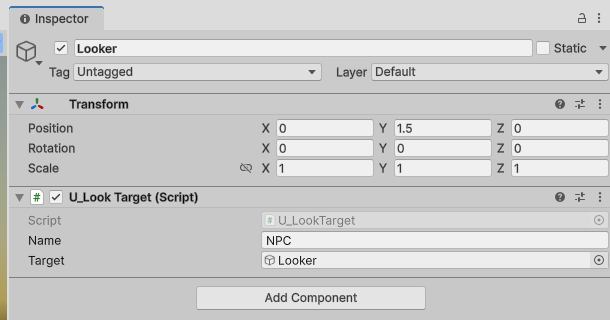

This looker can be added to the scene script if - for example - you wanted to be able to switch to it via the [Set_Looker](https://oyster.abulman.com/writing/supportedcommands/base/set_looker) command. However, that is not required unless that is the intention, as Oyster will fetch the character's looker from its character talker script. As well as that, the 'target' of the looker will default to the object it is currently on, which is identical to what we have set-up here. However, it can be a good habit to build for these links to be explicitly defined in the editor.

Next we will fill out the character data script with some information, and then explain what each parameter means:

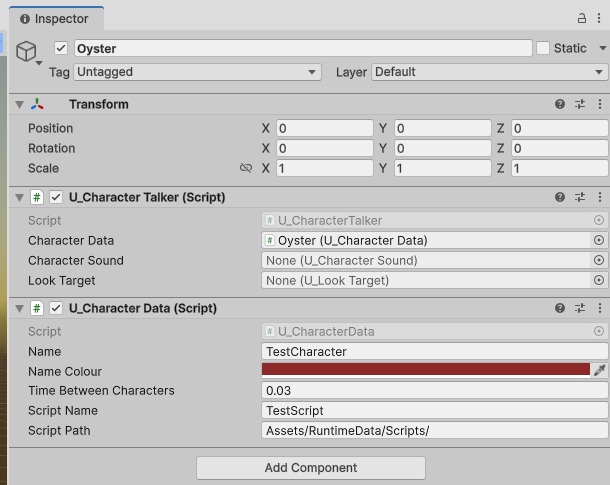

- **Name**: This is the name that will be shown in the 'NameText' field of the speech display when speaking to this character,
- **Name Colour**: This is the colour that the above name will be drawn with in the 'NameText' section of the speech display,
- **Time Between Characters**: This is the amount of time in seconds that Oyster will wait before pushing a new character to the 'MainText' display when running either [Act_Speak](https://oyster.abulman.com/writing/supportedcommands/base/act_speak) or [Act_Append](https://oyster.abulman.com/writing/supportedcommands/base/act_append),
- **Script Name & Script Path**: This bit of functionality can be overridden with any structure you wish, by creating alternate implementations of `A_CharacterData`, however in this standard implementation, these two parameters are combined to create a string of the form: `{ScriptPath}{ScriptName}.osf`, so in this example, the path would be `Assets/RuntimeData/Scripts/TestScript.osf`.

Now for the final step, simply drag the looker you created earlier onto the character talker, and you'll have officially created all three main components of a scene for Oyster!

Next we'll move onto writing your first script.

## Writing your first script

To start with, let's actually create the `.osf` file that our previously made character points to. To do this, let's create the relevant folder structure and then create the `.osf` file, as seen below:

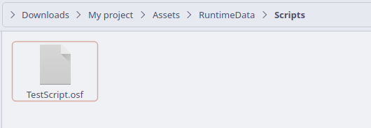

Next let's open this file in a text editor, for this tutorial Visual Studio Code will be used, as there exists an [Oyster Linter](https://marketplace.visualstudio.com/items?itemName=AnActualPan.oyster-linter) extension that can make writing scripts easier.

For this tutorial, the below script will be used, for information on what each of these commands do and how to lay out a script, see these relevant sections:

- [Built-in Commands](https://oyster.abulman.com/writing/supportedcommands/base),
- [Writing a script](https://oyster.abulman.com/writing/writingscripts/).

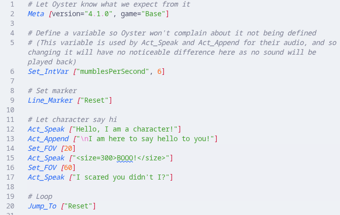

```py
# Let Oyster know what we expect from it
Meta [version="4.1.0", game="Base"]

# Define a variable so Oyster won't complain about it not being defined
# (This variable is used by Act_Speak and Act_Append for their audio, and so changing it will have no noticeable difference here as no sound will be played back)
Set_IntVar ["mumblesPerSecond", 6]

# Set Marker
Line_Marker ["Reset"]

# Let character say hi
Act_Speak ["Hello I am a character!"]
Act_Append ["\nI am here to say hello to you!"]
Set_FOV [20]
Act_Speak ["<size=300%>BOOO!"]
Set_FOV [60]
Act_Speak ["I scared you didn't I?"]

# Loop
Jump_To ["Reset"]
```

Feel free to take some time to read the documentation for all of these commands, to understand their purpose. In the next section we will write a simple script to start a conversation and handle user input.

Now we need to let Addressables know about this script, to do this, navigate to the script in the project window and select it in the inspector. Tick the 'Addressable' tick box near the name of the script. Now Addressables will generate a name for the script (by default it is the script path and file name).

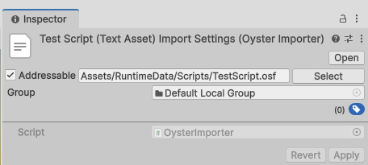

Note that the path of this script matches the constructed path that we defined in the character data earlier on.

## Starting a conversation

Firstly, create a new MonoBehaviour script with any name you wish in your assets folder and fill it out with the below code:

```csharp
using Oyster.Core;
using UnityEngine;
using UnityEngine.InputSystem;
using Assets.Lib.OysterInterop;

public class OysterManager : MonoBehaviour
{
    // Editor Variables
    [Header("Oyster Objects")]
    [SerializeField]
    private U_CharacterTalker _character;
    [SerializeField]
    private U_SceneScript _scene;
    [SerializeField]
    private U_PlayerTalker _player;

    private InputAction _nudgeAction;
    
    // Unity Methods
    private void Start()
    {
        // Start the chat with Oyster
        _scene.StartChat(_player.Talker, _character.Talker);

        // Subscribe to input
        _nudgeAction = InputSystem.actions.FindActionMap("Player").FindAction("Attack");
        _nudgeAction.performed += Nudge;
    }
    private void OnDestroy()
    {
        _nudgeAction.performed -= Nudge;
    }

    // Private Methods
    private void Nudge(InputAction.CallbackContext obj)
    {
        // Nudge Oyster
        OysterMain.Nudge();
    }
}
```

The 'Start' method in this code will attempt to start a conversation between the player and the character on the first frame. This script also handles calling the 'Nudge' action within Oyster when the default Unity control for the player's attack is used (left mouse button by default) (in versions of Unity prior to Unity 6, the InputSystem package may need to be installed from the package manager).

Now all you need to do is add this script to any object in the scene and pass in the related references as editor parameters. This is shown below:

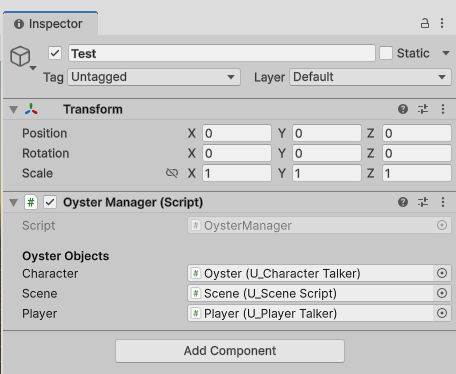

Once this is set-up, the scene can then be ran, and if every step was followed correctly, you should see what is pictured below:

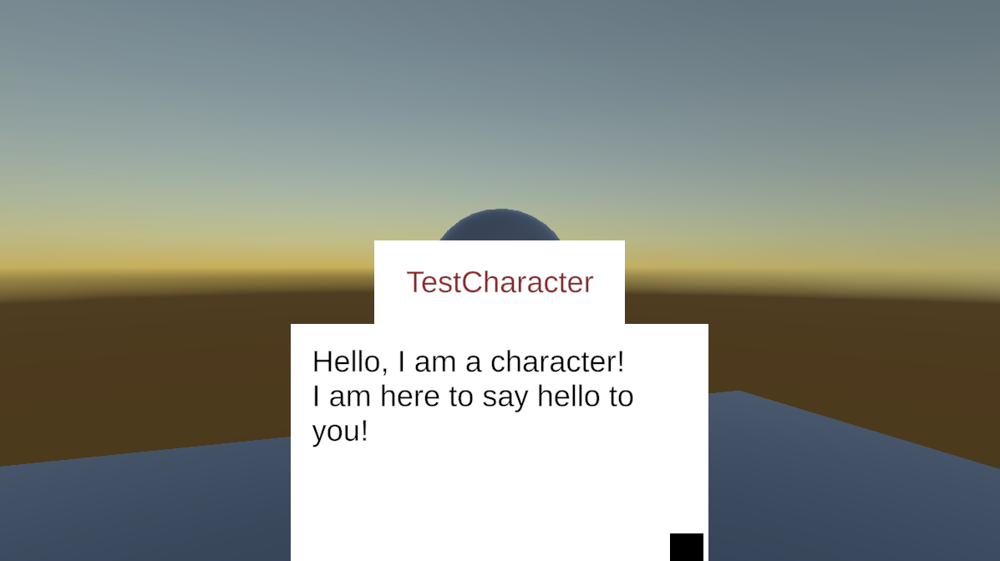

Congratulations! If you are not seeing this and are instead seeing a whole lot of runtime errors, god help you!